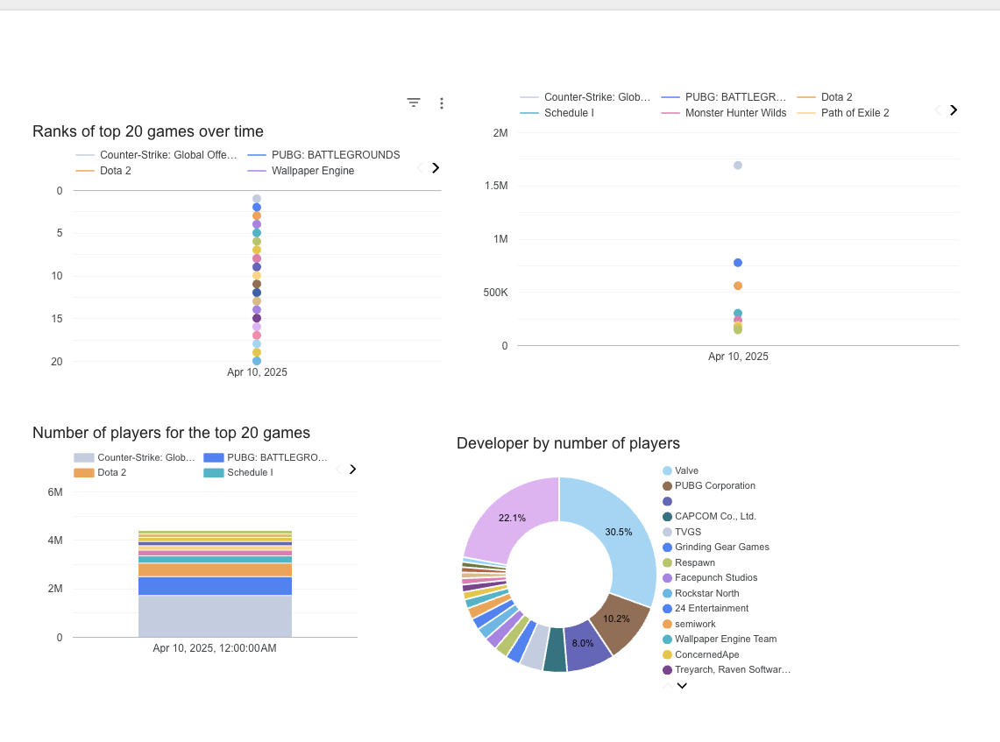
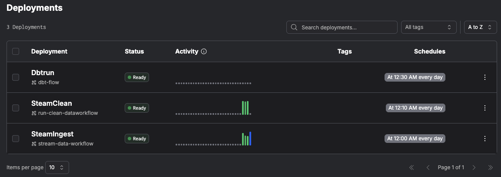
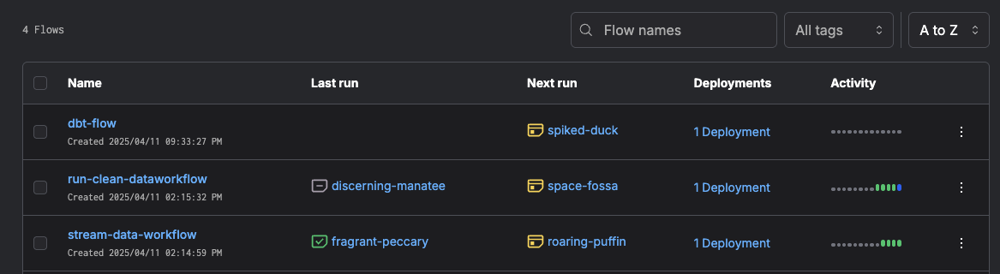
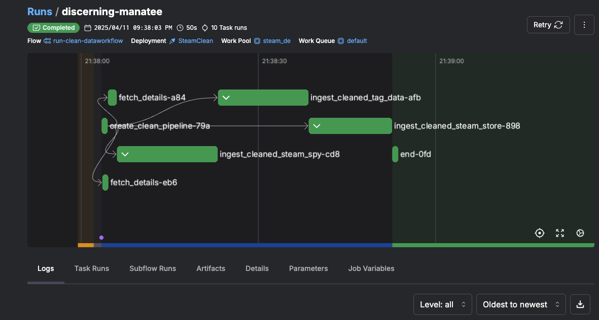

# Steam Data Engineering Project

This project implements a complete data pipeline for collecting, processing, and analyzing Steam game data. It uses modern data engineering tools including Prefect for workflow orchestration, DLT (Data Load Tool) for data loading, and dbt (data build tool) for transformation. It uses a scheduler to pull data every evening to update tables within big query, and then passed to Google Looker Studio for providing stats on the top popular games with the most concurrent players in the day.



## Goal

The goal of this project is to ingest and and then analyse trends such as game rankings, concurrent player counts, developer-level player distribution, and the relationship between discounts and review sentiment. These include trends in game popularity, developer distribution, discount-to-review correlations, and more.

The dashboard can be found [here](https://lookerstudio.google.com/u/0/reporting/29bd12eb-bffa-4aa8-be8a-6c1439f8241c/page/xLnFF)

## Project Overview

This pipeline collects data from multiple Steam-related APIs:

- Daily top 100 played games
- Game details from SteamSpy
- Game metadata from the Steam Store

The data is processed, cleaned, and stored in BigQuery, then transformed using dbt models to create analytics-ready tables.

## Project Structure

```
 ├── ingestion/            # Data ingestion code
 │   ├── src/              # Source modules
 │   │   ├── apis/         # API clients for different data sources
 │   │   ├── helpers/      # Helper utilities
 │   │   └── models/       # Pydantic models for data validation
 │   ├── ingest_pipeline.py  # Main ingestion workflow
 │   ├── clean_pipeline.py   # Data cleaning workflow
 │   └── dbt_run.py          # dbt execution workflow
 ├── dbt/                  # dbt project
 │   ├── models/           # dbt models
 │   │   ├── staging/      # Staging models
 │   │   ├── core/         # Core models
 │   │   └── dashboard/    # Dashboard/reporting models
 │   ├── macros/           # dbt macros
 │   └── dbt_project.yml   # dbt project configuration
 ├── Pipfile               # Pipenv dependencies
 ├── Makefile              # Utility commands
 └── requirements.txt      # Core requirements
```

## Getting Started

### Steam Data Engineering Architecture

The source data is primarily from multiple Steam-related APIs, providing game statistics, metadata, and user information.

Batch pipeline is implemented using Google Cloud Platform (GCP). A batch approach is appropriate as the Steam stats typically update daily rather than requiring real-time processing.

Prefect is used for workflow orchestration, providing scheduling, monitoring, and error handling for the entire data pipeline.

The pipeline follows a medallion architecture with bronze, silver, and gold data layers:

Bronze Layer (Raw Data):

- Data is ingested from multiple Steam APIs (Steam Top 100, SteamSpy, Steam Store)
- DLT (Data Load Tool) handles the API calls and initial data extraction
- Raw data is loaded directly into BigQuery staging tables

Silver Layer (Cleaned Data):

- A dedicated cleaning workflow processes the raw data
- Data is cleaned, standardized, and normalized
- Game tags and additional attributes are extracted from raw metadata
- Results are stored in separate cleaned tables in BigQuery

Gold Layer (Analytics-Ready Data):

- dbt transforms the silver layer data into analytics-ready models
- Models include staging views, core dimensional models, and dashboard-specific models
- Data is structured for optimal query performance for the dashboard
- Final tables are saved back to BigQuery

The pipeline runs on a scheduled basis, with the ingestion workflow running daily at midnight, followed by the cleaning workflow at 12:10 AM. This ensures fresh data is available each morning for analysis.

dbt models implement proper transformations including:

- Creation of proper relationships between different data sources
- Calculation of derived metrics like engagement rate and popularity trends
- Development of consistent dimensions for game attributes, developers, and tags

Dashboard visualizations are built in Google Looker Studio, connected directly to the gold layer tables in BigQuery. This provides insights into:

- Top games by concurrent players
- Player distribution across different game developers
- Correlation between discounts and positive reviews
- Trending games over time

The implementation is entirely cloud-based on GCP, making it scalable and team-friendly. The architecture allows for future extensions such as additional data sources or more complex transformation logic.

The codebase follows software engineering best practices, including:

- Type-validated data models using Pydantic
- Modular and reusable components for ingestion and transformation
- Separation of orchestration (Prefect), loading (DLT), and transformation (dbt)
- Cloud-native deployments on GCP with infrastructure-as-code via Makefile
- Automated testing for dbt models using dbt tests
- Uses black and isort for formating the python files

### Prerequisites

- Python 3.13
- Pipenv
- Google Cloud account with BigQuery access
- Service account with appropriate permissions
# Do this first!
Before progressing any further please follow the prerequisite [here](Prerequisites.md)

### Continue installation

1.  Set up BigQuery dataset:

```bash
make bq_dataset
```

6. Set up DBT Packages.

```bash
make dbt_setup
```

## Running the Pipeline

### Setting up Prefect

Use the provided Makefile command to set up Prefect:
```bash
make prefect_setup
```
This will:

1.  Start a Prefect server
2.  Configure the API URL
3.  Create a work queue
4.  Start a worker
5.  Deploy the workflows

You will be able to see the deployments of the flows on the **prefect server**: **localhost:4200** where you can see the deployments


if it is a blank page, you might need to stop the server and rerun the commnad above

```bash
make prefect_stop
make prefect_setup
```
### Running the Ingestion Pipeline Manually

To run the data ingestion pipeline:

```bash
make manual_ingest
```

### Running the Data Cleaning Pipeline Manually

To run the data cleaning pipeline:

```bash
make manual_clean
```

### Running the DBT pipeline

To run the dbt ETL pipeline:

```bash
make manual_dbt
```

After the flows have been run, you can see their flows in the flow, part of the prefect server.



If you click on one, of the flows you can see the graphs



## Pipeline Workflow

1.  Data Ingestion:

- Fetch top 100 played games on Steam
- Extract unique app IDs
- Fetch detailed game data from SteamSpy
- Fetch metadata from Steam Store API
- Load data into BigQuery staging tables

2.  Data Cleaning:

- Clean and standardize SteamSpy data
- Process Steam Store metadata
- Extract game tags and additional attributes
- Load cleaned data into separate tables

3.  Data Transformation (dbt):

- Create staging views
- Build core dimensional models
- Develop dashboard/reporting models

## Technologies Used

- Prefect: Workflow orchestration
- DLT: Data loading tool for ingesting data into BigQuery
- dbt: Data transformation and modeling
- BigQuery: Data warehouse
- Pipenv: Python dependency management
- Pydantic: Data validation and settings management

## Development

To stop the Prefect server:

```bash
make prefect_stop
```

### Future Enhancements

- Add support for real-time data ingestion with Kafka and BigQuery streaming inserts
- Integrate ML models to predict trending games based on metadata
- Extend the dashboard to include genre-based breakdowns and seasonal trends
- Build alerting workflows for anomalies in player activity using Prefect triggers

## License

This project is licensed under the MIT License - see the LICENSE file for details.
